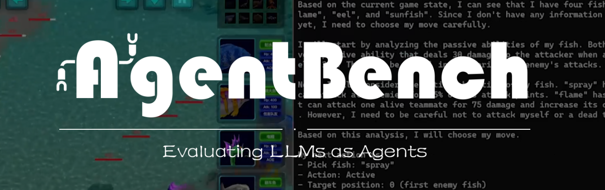

# AgentBench



<p align="center">
   <a href="https://llmbench.ai" target="_blank">🌐 Website</a> | <a href="https://twitter.com/thukeg" target="_blank">🐦 Twitter</a> | <a href="mailto:agentbench@googlegroups.com">✉️ Google Group</a> | <a href="https://arxiv.org/abs/2308.03688" target="_blank">📃 Paper </a>
</p>

# AgentBench: Evaluating LLMs as Agents

**AgentBench** is the first benchmark designed to evaluate **LLM-as-Agent** across a diverse spectrum of different
environments. It encompasses 8 distinct environments to provide a more comprehensive evaluation of the LLMs' ability to
operate as autonomous agents in various scenarios. These environments include 5 freshly created domains, namely

-   Operating System (OS)
-   Database (DB)
-   Knowledge Graph (KG)
-   Digital Card Game (DCG)
-   Lateral Thinking Puzzles (LTP)

<!--  -->

## Quick Start

This section will guide you on how to quickly use gpt-3.5-turbo-0125 as an agent to launch the `dbbench-std` and `os-std` tasks.
For the specific framework structure, please refer to [Framework Introduction](docs/Introduction_en.md).
For more detailed configuration and launch methods, please check [Configuration Guide](docs/Config_en.md)
and [Program Entrance Guide](docs/Entrance_en.md).

### Step 1. Prerequisites

Clone this repo and install the dependencies.

```bash
cd AgentBench
conda create -n agent-bench python=3.9
conda activate agent-bench
pip install -r requirements.txt
```

Ensure that [Docker](https://www.docker.com/) is properly installed.

```bash
docker ps
```

Build required images for `dbbench-std` and `os-std`.

```bash
docker pull mysql
docker pull ubuntu
docker build -f data/os_interaction/res/dockerfiles/default data/os_interaction/res/dockerfiles --tag local-os/default
docker build -f data/os_interaction/res/dockerfiles/packages data/os_interaction/res/dockerfiles --tag local-os/packages
docker build -f data/os_interaction/res/dockerfiles/ubuntu data/os_interaction/res/dockerfiles --tag local-os/ubuntu
```

### Step 2. Configure the Agent

Fill in your OpenAI API Key at the correct location in `configs/agents/openai-chat.yaml`. (e.g. `gpt-3.5-turbo-0125`)

You can try using `python -m src.client.agent_test` to check if your agent is configured correctly.

By default, `gpt-3.5-turbo-0125` will be started. You can replace it with other agents by modifying the parameters:

```bash
python -m src.client.agent_test --config configs/agents/api_agents.yaml --agent gpt-3.5-turbo-0125
```

### Step 3. Start the task server

Starting the task worker involves specific tasks. Manual starting might be cumbersome; hence, we provide an automated
script.

The assumption for this step is that ports from 5000 to 5015 are available. For Mac OS system, you may want to follow [here](https://stackoverflow.com/questions/69955686/why-cant-i-run-the-project-on-port-5000) to free port 5000 to use.

```bash
python -m src.start_task -a
```

This will launch five task_workers each for `dbbench-std` and `os-std` tasks and automatically connect them
to the controller on port 5000. **After executing this command, please allow approximately 1 minute for the task setup to complete.** If the terminal shows ".... 200 OK", you can open another terminal and follow step 4.

### Step 4. Start the assigner

This step is to actually start the tasks.

If everything is correctly configured so far, you can now initiate the task tests.

```bash
python -m src.assigner
```

## Next Steps

If you wish to launch more tasks or use other models, you can refer to the content
in [Configuration Guide](docs/Config_en.md) and [Program Entrance Guide](docs/Entrance_en.md).

For the environment of the remaining five tasks, you will need to download the Docker images we provide.

```
longinyu/agentbench-ltp
longinyu/agentbench-webshop
longinyu/agentbench-mind2web
longinyu/agentbench-card_game
longinyu/agentbench-alfworld
```

The resource consumption of a single task_worker for the eight tasks is roughly as follows; consider this when
launching:

| Task Name | Start-up Speed | Memory Consumption |
| --------- | -------------- | ------------------ |
| webshop   | ~3min          | ~15G               |
| mind2web  | ~5min          | ~1G                |
| db        | ~20s           | < 500M             |
| alfworld  | ~10s           | < 500M             |
| card_game | ~5s            | < 500M             |
| ltp       | ~5s            | < 500M             |
| os        | ~5s            | < 500M             |
| kg        | ~5s            | < 500M             |

# LLM-Agents

Creating advanced Large Language Model agents under the supervision of **Prof. Long Tran-Thanh**.

## Setup Instructions

### 1. Clone the Repository

```bash
git clone https://github.com/pelagecha/LLM-Agents
cd LLM-Agents
```

### 2. Create Conda Environment (Optional)

```bash
conda create --name llm python=3.11
conda activate llm
```

### 3. Install Dependencies

```bash
python3 -m pip install -r requirements.txt
```

This installs packages like **torch** and **transformers** for deep learning and NLP.
